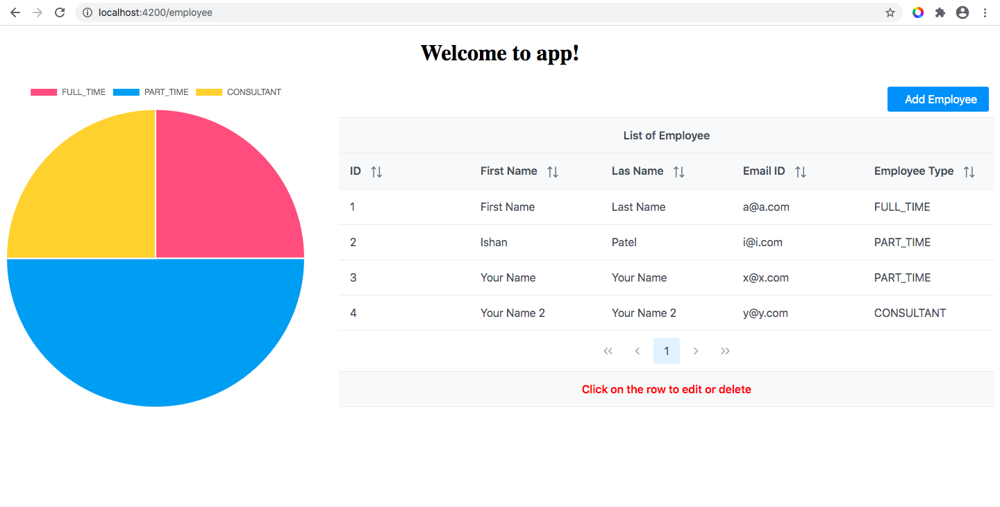

INTRODUCTION
------------

Backend: Spring Boot 2.3.0 Application(JPA, Spring Security, H2-Console, Swagger UI, Lombok)

FrontEnd: Angular 10.0 frontend(Primeng, Chart.JS)

Start Application in local
--------------------------
	
	Run backend on port 8080
	
	Run Frontend:
		- Run 'npm install' command in src/main/ngapp folder
		- then run 'ng serve --open' command in same folder

ScreenShot
----------

